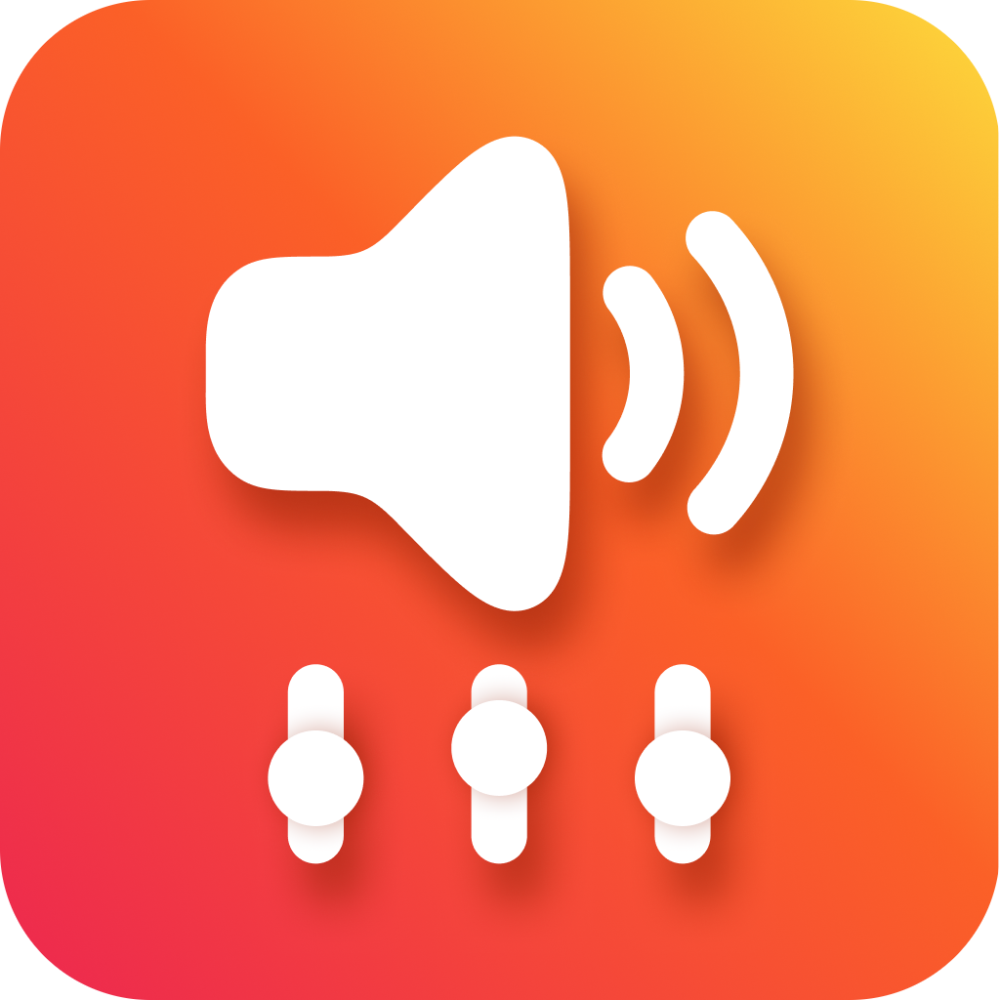
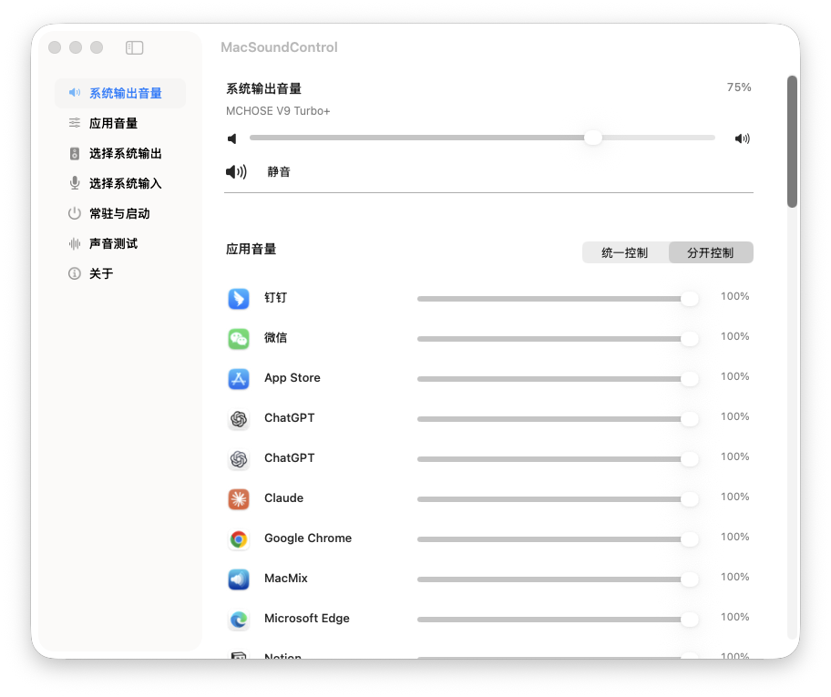
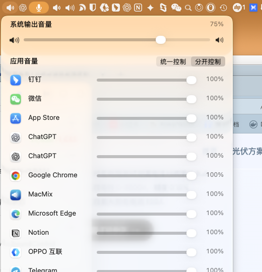

<a id="readme-top"></a>

<p align="center">
  
</p>

<h1 align="center">MacSoundControl</h1>

<p align="center">
  Native audio control for your Mac — from one menu.<br>
  一个菜单，控制 Mac 的系统声音、应用音量与麦克风。
</p>

<p align="center">
  <a href="#简体中文">简体中文</a> · <a href="#english">English</a>
</p>

<p align="center">
  <a href="https://github.com/RoperYoung/MacSoundControl/releases/tag/v1.0.0">下载 v1.0.0 / Download v1.0.0</a>
</p>

## Screenshots / 软件截图

<table>
  <tr>
    <td width="64%" align="center">
      
    </td>
    <td width="36%" align="center">
      
    </td>
  </tr>
  <tr>
    <td align="center">原生主窗口 / Native control window</td>
    <td align="center">菜单栏控制 / Menu bar controls</td>
  </tr>
</table>

---

## 简体中文

[English](#english) · [返回顶部](#readme-top)

### 一个真正原生的 Mac 音频控制面板

MacSoundControl 是一款原生 macOS 菜单栏工具，把日常声音控制集中在同一个地方：切换系统输入与输出、调整系统总音量、分别控制每个应用的音量，以及让麦克风保持在线。应用使用 AppKit 与 CoreAudio 构建，不使用 WebView，不显示多余的 Dock 图标。

当前公开版本为 **1.0.0（Build 100）**，提供 Apple Silicon 与 Intel 双架构 Universal App。

### 主要功能

- 在菜单栏或主窗口中查看并切换系统默认输入、默认输出。
- 调整当前系统输出音量，一键静音或恢复。
- 在 macOS 15 及以上分别保存和控制每个音频应用的 `0...100%` 音量。
- 随时在“统一控制”和“分开控制”两种应用音量模式间切换。
- 识别内建、蓝牙、USB、显示器、AirPlay、连续互通与虚拟音频设备。
- 可选隐藏虚拟设备，保持设备列表简洁。
- 让当前系统麦克风保持在线，减少部分蓝牙或无线麦克风重新唤醒的等待。
- 提供开机自动启动和输入通道手动重连。
- 提供实时声音输入测试，以 36 段电平、百分比和相对数字满刻度 `dBFS` 显示输入强度。
- 通过 Sparkle 自动检查更新；下载、签名校验、替换和重启均使用原生更新流程。

### 系统要求与权限

| 能力 | 要求 |
| --- | --- |
| 设备切换、系统音量、麦克风常驻、声音测试 | macOS 14 或更高版本 |
| 分应用音量 | macOS 15 或更高版本 |
| 麦克风常驻与声音测试 | 麦克风权限 |
| 分应用音量 | “系统设置 → 隐私与安全性 → 屏幕与系统音频录制”权限 |

HDMI、DisplayPort 或部分外置设备可能不提供可写的系统主音量。此时 MacSoundControl 仍可切换设备，但音量需要通过显示器、扩音器或设备本身调整。

### 安装

1. 从 [GitHub Releases](https://github.com/RoperYoung/MacSoundControl/releases/tag/v1.0.0) 下载 `MacSoundControl-1.0.0-build100-universal-notarized.dmg`。
2. 打开 DMG，把 `MacSoundControl.app` 拖入“应用程序”。
3. 启动 MacSoundControl，并按实际使用的功能授予麦克风或系统音频权限。
4. 点击菜单栏中的扬声器图标开始使用。

正式 DMG 与应用均使用 Apple Developer ID 签名、提交 Apple 公证并装订公证票据。

### 应用内更新

MacSoundControl 使用 Sparkle 2.9.4。应用会定期读取 GitHub Pages 上的静态 `appcast.xml`；也可以在主窗口“关于”区段点击“检查更新”。发现新版本后，由 Sparkle 的原生界面让你决定是否下载安装，应用默认不会静默安装更新。

更新 ZIP 同时经过以下三层验证：

- Apple Developer ID 签名；
- Apple 公证；
- Sparkle EdDSA 更新签名。

更新文件由 GitHub Releases 托管，更新清单由 GitHub Pages 托管，不需要自建更新后台或 GitHub Token。

### 隐私

- 麦克风与应用音频只在当前 Mac 的内存中实时处理。
- 音频不会录制、写入磁盘、播放、上传或用于语音识别。
- 应用没有账号、遥测、自建服务端、写入型 HTTP API 或数据库。
- 网络访问仅用于读取静态更新清单，并在你确认后下载 GitHub Release 更新包。

### 从源码构建

需要 Xcode Command Line Tools，以及首次获取 Sparkle 依赖时可访问 GitHub 的网络连接。

```bash
git clone https://github.com/RoperYoung/MacSoundControl.git
cd MacSoundControl
./build.sh
open "Build/Release/MacSoundControl.app"
```

`build.sh` 默认构建 arm64 + x86_64 Universal App、嵌入并校验固定版本的 Sparkle，并使用适合本机测试的 ad-hoc hardened runtime 签名。正式发布还需要 Developer ID 身份、Apple 公证配置与 Sparkle 私钥。

### 项目结构

```text
Sources/                 AppKit、CoreAudio、AVFoundation 与应用逻辑
Tests/                   纯 Swift 回归与 AppKit 界面探针
Assets/                  应用图标与菜单栏模板图标
docs/images/             README 真实运行截图
Info.plist               版本、权限说明与 Sparkle 更新配置
Entitlements.plist       音频输入 entitlement
build.sh                 Universal App 构建与签名入口
scripts/                 Sparkle 固定版本获取与校验工具
THIRD_PARTY_NOTICES.md   第三方来源与许可
```

### 许可

仓库整体项目许可证尚待维护者确认。`ApplicationAudioMixer.swift` 中源自 MacMix 的部分遵循 MIT License，Sparkle 保留其原始许可；完整信息见 [THIRD_PARTY_NOTICES.md](THIRD_PARTY_NOTICES.md)。

---

## English

[简体中文](#简体中文) · [Back to top](#readme-top)

### A truly native audio control panel for Mac

MacSoundControl is a native macOS menu bar utility that keeps everyday audio controls in one place: switch the system input and output, adjust the main output volume, control each application's volume independently, and keep your microphone alive. It is built with AppKit and CoreAudio, uses no WebView, and stays out of the Dock.

The first public release is **1.0.0 (Build 100)** and ships as a Universal app for both Apple Silicon and Intel Macs.

### Highlights

- View and switch the default system input and output from the menu bar or main window.
- Adjust the current system output volume and toggle mute.
- Save and control each audio application's volume from `0...100%` on macOS 15 or later.
- Switch between unified and per-app volume modes at any time.
- Recognize built-in, Bluetooth, USB, display, AirPlay, Continuity, and virtual audio devices.
- Hide virtual devices when you want a cleaner list.
- Keep the current system microphone active to reduce wake-up delays on some Bluetooth or wireless microphones.
- Optionally launch at login and manually reconnect the current input channel.
- Test microphone input in real time with a 36-segment meter, percentage, and relative `dBFS` level.
- Check for updates through Sparkle, using its native download, signature verification, replacement, and relaunch flow.

### Requirements and permissions

| Capability | Requirement |
| --- | --- |
| Device switching, system volume, mic keep-alive, and input test | macOS 14 or later |
| Per-application volume | macOS 15 or later |
| Mic keep-alive and input test | Microphone permission |
| Per-application volume | Screen & System Audio Recording permission in System Settings |

HDMI, DisplayPort, and some external devices do not expose a writable main-volume property. MacSoundControl can still switch to those devices, but their volume must be adjusted on the display, amplifier, or hardware itself.

### Install

1. Download `MacSoundControl-1.0.0-build100-universal-notarized.dmg` from [GitHub Releases](https://github.com/RoperYoung/MacSoundControl/releases/tag/v1.0.0).
2. Open the DMG and drag `MacSoundControl.app` into Applications.
3. Launch MacSoundControl and grant microphone or system-audio access only for the features you use.
4. Click the speaker icon in the menu bar.

The production app and DMG are signed with Apple Developer ID, notarized by Apple, and stapled with their notarization tickets.

### In-app updates

MacSoundControl uses Sparkle 2.9.4. It periodically reads a static `appcast.xml` from GitHub Pages, and you can run the same check manually from the About section. When an update is available, Sparkle asks before downloading and installing it; silent installation is disabled by default.

Every update ZIP is protected by three independent checks:

- Apple Developer ID signing;
- Apple notarization;
- Sparkle EdDSA update signing.

GitHub Releases hosts the update files and GitHub Pages hosts the feed. No custom update server or GitHub token is required.

### Privacy

- Microphone and application audio are processed only in memory on the current Mac.
- Audio is never recorded, written to disk, played back, uploaded, or used for speech recognition.
- The app has no account system, telemetry, custom backend, write API, or database.
- Network access is limited to reading the static update feed and downloading a GitHub Release only after you approve it.

### Build from source

You need Xcode Command Line Tools and a network connection to GitHub the first time the pinned Sparkle dependency is fetched.

```bash
git clone https://github.com/RoperYoung/MacSoundControl.git
cd MacSoundControl
./build.sh
open "Build/Release/MacSoundControl.app"
```

By default, `build.sh` creates an arm64 + x86_64 Universal app, embeds and verifies the pinned Sparkle release, and applies an ad-hoc hardened-runtime signature suitable for local testing. A production release additionally requires a Developer ID identity, Apple notarization credentials, and the Sparkle private key.

### Repository layout

```text
Sources/                 AppKit, CoreAudio, AVFoundation, and app logic
Tests/                   Pure Swift regressions and AppKit visual probes
Assets/                  App and menu bar artwork
docs/images/             Real runtime screenshots used by this README
Info.plist               Version, permission copy, and Sparkle settings
Entitlements.plist       Audio-input entitlement
build.sh                 Universal build and signing entry point
scripts/                 Pinned Sparkle fetch and verification helper
THIRD_PARTY_NOTICES.md   Third-party attribution and licenses
```

### License

The repository-wide project license has not yet been declared by the maintainer. The MacMix-derived portions of `ApplicationAudioMixer.swift` remain under the MIT License, and Sparkle retains its original license. See [THIRD_PARTY_NOTICES.md](THIRD_PARTY_NOTICES.md) for details.

<p align="right"><a href="#readme-top">Back to top / 返回顶部</a></p>
